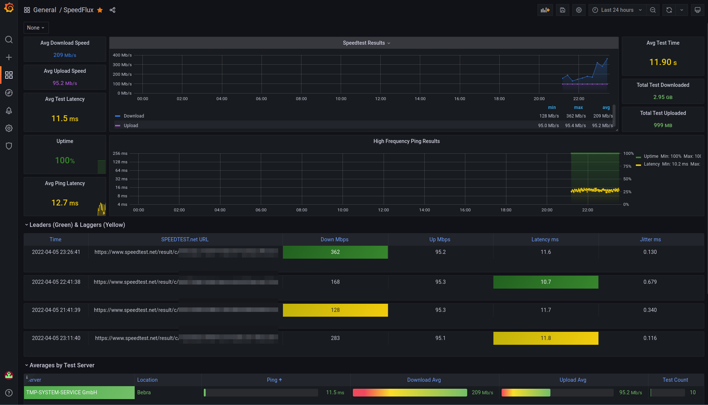

# Docker InfluxDB + Grafana + SpeedFlux
This repository is kind of a fork from https://github.com/yggdrion/SpeedFlux, but I wanted to have a "All-In-One"-Solution to make the speedtest dashboard work without creating a data source or importing a dashboard manually.
This is how I've done, so far.



## TL;DR

<details><summary>Click to read the summary</summary>

1. Install [Docker](https://docs.docker.com/get-docker/) and [Docker-Compose](https://docs.docker.com/compose/install/)
1. Clone this repository
1. Rename or copy `.env-example` as `.env` and update values to fit your needs
1. Start stack via `docker-compose up -d`
1. Visit `${GRAFANA_HOST_IP}:3000` and log in using `${GRAFANA_ADMIN_USER}` and `${GRAFANA_ADMIN_PASSWORD}`
1. Watch your speedtest results on your new Dashboard **SpeedFlux**
</details>

---

# Modify `.env`-File
1. `cp .env-example .env`
1. Modify varaibles to fit your needs

<details><summary>Click to expand variable table</summary>

|Variable Name|Description|Default|
|---|---|---|
INFLUXDB_REPORTING_DISABLED|Disables temeletry|true
INFLUXDB_RETENTION_ENABLED|Enforces disabling retention periods due to errors if enabled|false
INFLUXDB_PROTOCOLL||http
INFLUXDB_IP||influxdb
INFLUXDB_PORT||8086
INFLUXDB_ADMIN_USER||adminusername
INFLUXDB_ADMIN_PASSWORD||adminpassword
INFLUXDB_USER||username
INFLUXDB_USER_PASSWORD||password
INFLUXDB_DB||speedflux
GRAFANA_ADMIN_USER||adminusername
GRAFANA_ADMIN_PASSWORD||adminpassword
GF_DATASOURCE_INFLUXDB_NAME|Used for Grafana Provisioning|SpeedfluxDB_v1
NAMESPACE||None
INFLUXDB_TAGS|Gather all data|'*'
SPEEDTEST_INTERVAL||15
PING_INTERVAL||60 
PING_TARGETS||1.1.1.1, 8.8.8.8
LOG_TYPE||info
</details>

# Custom config files
In case you want to customize service config files, that's how you get the default config and modify them.

## Create directories, first:
```sh
mkdir -p {grafana,influxdb}/conf
```
## Grafana
```sh
docker run --rm --entrypoint /bin/bash grafana/grafana-oss:latest -c 'cat $GF_PATHS_CONFIG' > ./grafana/conf/grafana.ini
```
## influxdb
```sh
docker run --rm influxdb:1.8 influxd print-config > influxdb/conf/config.yml
```

## Uncomment volume mounts in `docker-compose.yml`
Uncomment the volume mounts of the service you want to enable the custom config for.

### Example:
To enable custom configuration for InfluxDB, search for those lines:
```
(...)
    #volumes:
    #  - ${PWD}/influxdb/conf/influxdb.conf:/etc/influxdb/influxdb.conf:ro
(...)
```
and replace them with:
```
(...)
    volumes:
      - ${PWD}/influxdb/conf/influxdb.conf:/etc/influxdb/influxdb.conf:ro
(...)
```
---

*SpeedFlux* looks to have been originally written by https://github.com/aidengilmartin/speedtest-to-influxdb and I modified it from https://github.com/yggdrion/SpeedFlux. They did the hard work, I've continued to modify it though to fit my needs.
